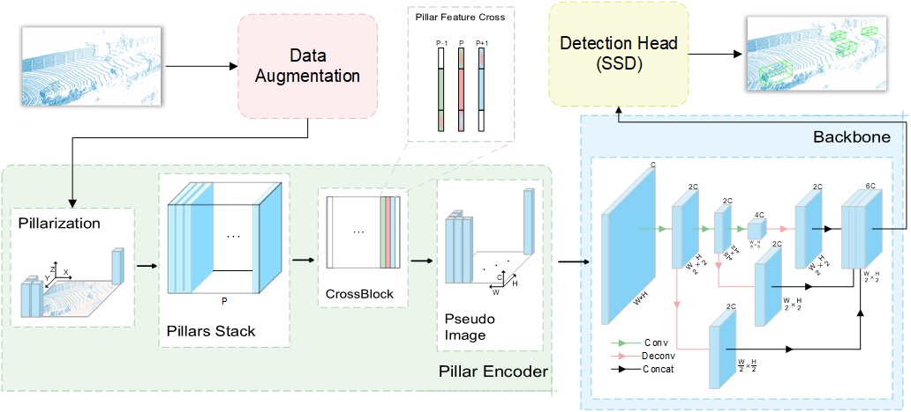

# XPillars: Enhancing 3D Object Detection through Cross-Pillar Feature Fusion

**Lijuan Zhang, Zihan Fu, Zhiyi Li, Dongming Li**

## Introduction

This repo is the  implementation of paper: **XPillars: Enhancing 3D Object Detection through Cross-Pillar Feature Fusion** as well as based on the powerful open source point cloud detection framework [OpenPCDet](https://github.com/open-mmlab/OpenPCDet). Our XPillars achieves high performance on KITTI Dataset with real-time inference speed (65Hz). We have made every effort to ensure that the codebase is clean, concise, easily readable, and relies only on minimal dependencies.
<div align="center">
  
</div>

## Installation

### Requirements
All the codes are tested in the following environment:
* Ubuntu 22.04
* Python 3.10, 3.8
* PyTorch 2.4.1, 1.10
* CUDA 12.1, 11.3

The following environments are also available but never tested:
* Linux (tested on Ubuntu 14.04/16.04/18.04/20.04/21.04)
* Python 3.6+
* PyTorch 1.1 or higher (tested on PyTorch 1.1, 1,3, 1,5~1.10)
* CUDA 9.0 or higher (PyTorch 1.3+ needs CUDA 9.2+)

### Install 

a. Clone this repository.

b. Install the dependent libraries as follows:

* Install the SparseConv library, we use the implementation from [`[spconv]`](https://github.com/traveller59/spconv). 
    * If you use PyTorch 1.1, then make sure you install the `spconv v1.0` with ([commit 8da6f96](https://github.com/traveller59/spconv/tree/8da6f967fb9a054d8870c3515b1b44eca2103634)) instead of the latest one.
    * If you use PyTorch 1.3+, then you need to install the `spconv v1.2`. As mentioned by the author of [`spconv`](https://github.com/traveller59/spconv), you need to use their docker if you use PyTorch 1.4+. 
    * You could also install latest `spconv v2.x` with pip, see the official documents of [spconv](https://github.com/traveller59/spconv).
  
c. Install this library and its dependent libraries by running the following command:
```shell
python setup.py develop
```

## Data Preparation

* Please download the official [KITTI 3D object detection](http://www.cvlibs.net/datasets/kitti/eval_object.php?obj_benchmark=3d) dataset and organize the downloaded files as follows:

```
OpenPCDet
├── data
│   ├── kitti
│   │   │── ImageSets
│   │   │── training
│   │   │   ├──calib & velodyne & label_2 & image_2
│   │   │── testing
│   │   │   ├──calib & velodyne & image_2
├── pcdet
├── tools
```

* Generate the data infos by running the following command: 
```python 
python -m pcdet.datasets.kitti.kitti_dataset create_kitti_infos tools/cfgs/dataset_configs/kitti_dataset.yaml
```

## Training & Testing

```shell script
cd tools
python train.py
python test.py
```


## Visualization

TODO


## Acknowledgement
This repo is based on the open source project [OpenPCDet](https://github.com/open-mmlab/OpenPCDet).

This work was also supported by the National Natural Science Foundation of China (No. 62206257); "Light of the Taihu Lake" scientific and technological research project for Wuxi Science and Technology Development Fund (No. K20241044)；Wuxi University Research Start-up Fund for Introduced Talents (No.2023r004, 2023r006); Wuxi City Internet of Vehicles Key Laboratory.
